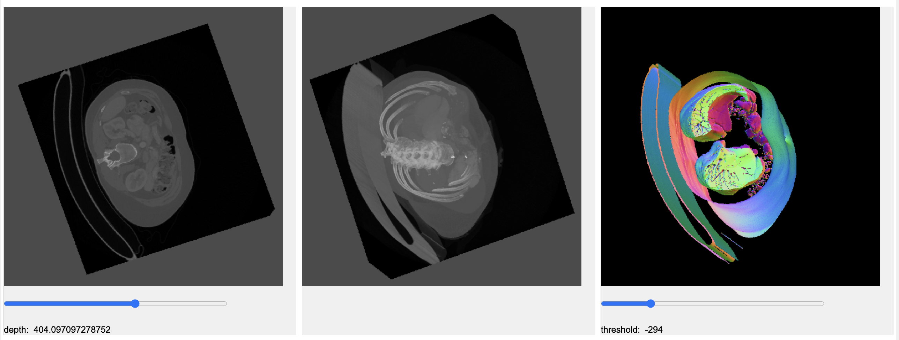

# webgpu_volume



WebGPU support for 3 dense dimensional volume image processing.

Please see
<a href="https://users.flatironinstitute.org/~awatters/volumes/html/listing.html">
https://users.flatironinstitute.org/~awatters/volumes/html/listing.html</a> for some
volume viewer examples built using this library.

```bash
npm run build
npm run dev
```

## Update all dependenciess

```bash
rm -r package-lock.json node_modules
npm install
```